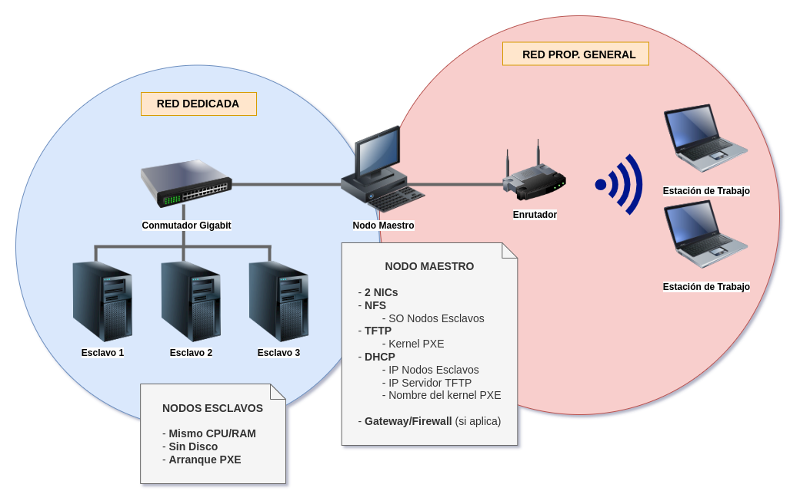

# Manual de Configuración

- [1. Introducción](#1)
- [2. Instalar y configurar nodo maestro](#2)
- [3. Configurar esclavo base](#3)
- [4. Crear nodos esclavo](#4)
- [5. Test OpenMPI](#5)

## 1. Introducción<a id="1"></a>

Consideramos la siguiente arquitectura:



El clúster se encuentra conformado por los siguientes elementos críticos:

- **3 nodos esclavos**: realizan las operaciones de cómputo del clúster.
    - No requieren disco duro.
    - Soporte arranque PXE.
- **1 nodo maestro**: controla operaciones y provee servicios tanto al clúster como a la red general.
    - Requiere 2 NICs.
- **1 conmutador**: da soporte para la red interna del clúster.


Los **servicios** que proporciona el cluster son los siguientes.

- El **nodo maestro** proporciona los siguientes servicios:
    - TFTP: proporciona los ficheros necesarios para el arranque por red (PXE) a los esclavos.
    - NFS: provee el sistema de archivos raíz de cada esclavo.
    - DHCP: asigna la configuración IP y de arranque (PXE) a cada nodo.
    - SSH: permite el acceso a los usuarios del clúster.

- Los **nodos esclavo** únicamente cuentan con un servidor SSH necesario para el acceso y control desde el nodo maestro.

Para el caso de la **red interna del clúster**, tenemos control total sobre los parámetros de red. Dicho eso, consideramos lo siguiente:

- Usamos la red 10.0.33.0/28 (16 direcciones)
    - Nodos esclavos: 10.0.33.1-5 (5 hosts)
    - Pruebas: 10.0.33.6-10 (5 hosts)
    - Servicios: 10.0.33.11-14 (4 hosts)
    - Broadcast: 10.0.33.15

Para el caso de la red de propósito general, dejaremos la configuración de direccionamiento de forma automática.

## 2. Instalar y configurar nodo maestro<a id="2"></a>

De momento, el nodo maestro no requiere ninguna configuración especial, por lo que procedemos a instalar únicamente el sistema base de Debian. Esto lo hacemos mediante el instalador *netinstall* del [sitio oficial](https://www.debian.org/CD/netinst/). Una vez en el sitio, vamos a la sección de descargas y seleccionamos la arquitectura deseada (amd64, arm64, i386, etc.) y el medio de descarga (http o torrent).

Una vez descargada la imagen ISO del sistema, procedemos a copiarla en un USB. **IMPORTANTE**: modificar los valores `if=` y `of=` como corresponda.

```bash
dd if=/home/user/downloads/debian.iso of=/dev/sdb status=progress conv=fsync
```

Ahora procedemos a arrancar el nodo maestro desde la USB que acabamos de crear. Y realizamos una **instalación mínima**. Algunos puntos importantes sobre la instalación son los siguientes:

- Configurar el nombre del host (p. ej. `masternode`).
- Configurar una cuenta de root y su contraseña apropiadamente.
- Configurar un usuario sin privilegios y su contraseña apropiadamente (p. ej. `user`).
- Se puede utilizar el particionado guiado en todo el disco, pero se recomienda implementar LVM (al menos para `/`, `/srv`) para facilitar ajustes futuros.
- Al momento de seleccionar el software, desmarcar todas las opciones. 

Procedemos con el resto de configuración como resulte conveniente, terminamos la instalación y arrancamos nuestro nuevo sistema.

Una vez el nuevo sistema completamente limpio, pasamos a configurar las 2 interfaces del red en `/etc/network/interfaces`. Si es posible, configuramos ambas interfaces con direcciones estáticas, de lo contrario, dejamos una en automático (la de la red general) y la otra estática para la red interna del clúster.

```
auto [INT_1]
iface [INT_1] inet dhcp

auto [INT_2]
iface [INT_2] inet static
    address 10.0.33.14
    netmask 255.255.255.240
    network 10.0.33.0
    broadcast 10.0.33.15
```

Ahora instalamos el software necesario para la configuración de los servicios.

```bash
apt install tftpd-hpa nfs-kernel-server isc-dhcp-server openssh-server openmpi-bin nfs-common syslinux pxelinux debootstrap build-essential libopenmpi-dev
```

Procedemos a configurar el servicio SSH, de modo que podamos acceder al usuario sin privilegios que creamos durante la instalación (p. ej. `user`, **no root**). Se recomienda configurar lo siguiente:

- En caso de tener una IP estática en la red general, la configuramos para que el servidor SSH únicamente ofrezca el servicio en esa red y NO en la red interna del clúster.
- Desactivar completamente el acceso por contraseña y, en cambio, utilizar un par de claves SSH.
- No permitir el acceso remoto a la cuenta `root`.
- Considerar [otros ajustes](https://www.digitalocean.com/community/tutorials/how-to-harden-openssh-on-ubuntu-18-04-es) de hardenización de SSH.

Reiniciamos el servicio SSH para aplicar la nueva configuración.
```bash
systemctl restart sshd.service
```

Configuramos el servicio DHCP. En primer lugar, indicamos el archivo de configuración y la interfaz
que vamos a utilizar en `/etc/default/isc-dhcp-server`.

```
DHCPDv4_CONF=/etc/dhcp/dhcpd.conf
DHCPDv4_PID=/var/run/dhcpd.pid
INTERFACESv4="[IFACE]"
```

Luego pasamos a configurar propiamente el servicio DHCP en el archivo de configuración que indicamos
`/etc/dhcp/dhcpd.conf`.

```
allow booting;
allow bootp;
subnet 10.0.33.0 netmask 255.255.255.240 {
    range 10.0.33.6 10.0.33.10;
    option routers 10.0.33.14;
    option broadcast-address 10.0.33.15;
}
```

Ahora procedemos a crear el directorio del servicio TFTP (si no existe ya). Este directorio va a contener los archivos y configuración de arranque de los esclavos.

```bash
mkdir /srv/tftp
```

Configuramos el servicio en el archivo `/etc/default/tftpd-hpa`.

```
TFTP_USERNAME="tftp"
TFTP_DIRECTORY="/srv/tftp"
TFTP_ADDRESS="10.0.33.14:69"
TFTP_OPTIONS="--secure"
```

Reiniciamos los servicios para aplicar la configuración.

```bash
systemctl restart tftpd-hpa isc-dhcp-server
```

Creamos el usuario dedicado `mpi` para las operaciones de control del clúster.

```bash
groupadd -g 9999 mpi
useradd -m -r -s /bin/bash -u 9999 -g 9999 mpi
passwd mpi
```

Accedemos al usuario `mpi`, y le configuramos un par de claves SSH para posteriormente copiarlas a la configuración base del nodo esclavo para accederlo remotamente. Cuando el comando `ssh-keygen` nos pida la contraseña de la clave, **la dejamos vacía**.

```bash
su mpi
ssh-keygen -t rsa -b 4096
```

También creamos el directorio `cloud` en el directorio del usuario `mpi` para operaciones específicas del clúster.

```bash
mkdir /home/mpi/cloud
```

Salimos del usuario `mpi`.

## 3. Configurar esclavo base<a id="3"></a>

Primero necesitamos crear un directorio para nuestro sistema de archivos genérico y luego descargamos el sistema base. 

```bash
mkdir /srv/nfs/nodeX
debootstrap --arch amd64 bullseye /srv/nfs/nodeX https://deb.debian.org/debian
```

En este punto el sistema base pesa aproximadamente 300 MB y toma al rededor de 5 minutos dependiendo de la velocidad de descarga.

---

**Sobre CHROOT**

Para "acceder" al sistema de archivos del nodo genérico (y de cualquier nodo), usamos una jaula *chroot* de la siguiente forma.

```bash
# ANTES de chroot
mount -o bind /dev /srv/nfs/nodeX/dev
mount -o bind /run /srv/nfs/nodeX/run
mount -o bind /sys /srv/nfs/nodeX/sys

chroot /srv/nfs/nodeX/

# DENTRO de chroot
mount -t proc proc proc
```

**IMPORTANTE**: al terminar de usar una jaula, desmontar las particiones.

---

Ahora que ya tenemos nuestro sistema base descargado, procedemos a configurarlo. Primero vamos a configurar los mismos repositorios que tenemos en el nodo maestro.

```bash
cat /etc/apt/sources.list > /srv/nfs/nodeX/etc/apt/sources.list
```

Ahora **accedemos a la jaula** y actualizamos el sistema.

```bash 
apt update && apt full-upgrade -y
```

Configuramos una contraseña para `root`.

```bash
passwd
```

Procedemos a instalar el software que necesitamos en cada nodo esclavo.

```bash
apt install openssh-server initramfs-tools linux-image-amd64 openmpi-bin nfs-common vim
```

**IMPORTANTE**: verificar que el kernel instalado (`linux-image-amd64`) en el sistema base es el mismo que el que tenemos en el nodo maestro.


Creamos el usuario `mpi` y le configuramos una contraseña.

```bash
groupadd -g 9999 mpi
useradd -m -r -s /bin/bash -u 9999 -g 9999 mpi
passwd mpi
```

Salimos **temporalmente de la jaula** para recuperar la clave pública SSH del usuario `mpi` del nodo maestro, y la copiamos en el directorio `/home` del usuario `mpi` del nodo genérico. Finalmente, **entramos de nuevo en la jaula** para seguir con la configuración.

```bash
cp /home/mpi/.ssh/id_rsa.pub /srv/nfs/nodeX/home/mpi
chroot /srv/nfs/nodeX
```

Accedemos al usuario y creamos su directorio `/home/mpi/.ssh` para copiar ahí la clave pública SSH del nodo maestro en el archivo `authorized_keys`.

```bash
su mpi
mkdir /home/mpi/.ssh
cat /home/mpi/id_rsa.pub > /home/mpi/.ssh/authorized_keys
rm id_rsa.pub
```

**Regresamos al usuario root**  y configuramos los puntos de montaje en `/etc/fstab`.

```
/dev/nfs / nfs tcp,nolock 0 0
proc /proc proc defaults 0 0
none /tmp tmpfs defaults 0 0
none /var/tmp tmpfs defaults 0 0
none /media tmpfs defaults 0 0
none /var/log tmpfs defaults 0 0

10.0.33.14:/home/mpi/cloud /home/mpi/cloud nfs
```

Configurar initramfs para que incluya el módulo NFS durante el arranque.

```bash
echo BOOT=nfs >> /etc/initramfs-tools/initramfs.conf
```

Generamos el sistema de archivos RAM inicial y el kernel, ambos para el arranque PXE.

```bash
mkinitramfs -o /boot/initrd.pxe
update-initramfs -u
cp -vax /boot/initrd.img-$(uname-r) /boot/initrd.pxe
cp -vax /boot/vmlinuz-$(uname -r) /boot/vmlinuz.pxe
```

Procedemos a **salir de chroot** (no olvidar desmontar los directorios `/proc`, `/sys`, `/dev`, `/run` y demás monturas asociadas a la jaula).

Recuperamos los archivos de arranque y los ubicamos en el directorio del servicio TFTP.

```bash
cp -vax /srv/nfs/nodeX/boot/*.pxe /srv/tftp
cp -vax /usr/lib/PXELINUX/pxelinux.0 /srv/tftp
cp -vax /usr/lib/syslinux/modules/bios/ldlinux.c32 /srv/tftp
```

Finalmente, establecemos un nombre del host para el sistema base de los esclavos (el cuál, cambiaremos cuando vayamos a configurar el nodo).

```bash
echo nodeX > /srv/nfs/nodeX/etc/hostname
```

Ahora generamos el archivo que contiene nuestro sistema de archivos genérico para los esclavos.

```bash
tar cf /srv/nfs/nodeX.tar -C /srv/nfs/ nodeX --remove-files
```

## 4. Crear nodos esclavo<a id="4"></a>

Agregamos la dirección MAC y su IP asociada a la configuración del servidor DHCP. Para ello, creamos
un grupo **dentro** de la configuración de la subred que ya habíamos indicado anteriormente. La configuración DHCP quedaría de la siguiente forma con 3 nodos.

**NOTA**: ajustar `[MAC]` como corresponda.

```
allow booting;
allow bootp;
subnet 10.0.33.0 netmask 255.255.255.240 {
    range 10.0.33.6 10.0.33.10;
    option routers 10.0.33.14;
    option broadcast-address 10.0.33.15;
    group {
        filename "pxelinux.0";
        next-server 10.0.33.14;
        host node1 {
            hardware ethernet [MAC];
            fixed-address 10.0.33.1;
        }
        host node1 {
            hardware ethernet [MAC];
            fixed-address 10.0.33.2;
        }
        host node1 {
            hardware ethernet [MAC];
            fixed-address 10.0.33.3;
        }
    }
}
```

Reiniciamos el servidor DHCP.

```bash
systemctl restart isc-dhcp-server
```

Ahora creeamos el sistema de archivos para cada nodo que vayamos a necesitar. Los sistemas de archivos los ubicaremos en el directorio `/srv/nfs`. Procedemos a extraer cada sistema de archivos, y de paso, configuramos el nombre del host de cada esclavo.

```bash
cd /srv/nfs

for node in {node1,node2,node3}; do
    tar xf nodeX.tar
    mv nodeX $node1
    echo $node1 > $node1/etc/hostname
done
```

Agregamos los sistemas de archivos de los nodos a `/etc/exports`. También servimos el directorio especial `cloud` a toda la subred.

```
/srv/nfs/node1 10.0.33.1(rw,async,no_root_squash,no_subtree_check)
/srv/nfs/node2 10.0.33.2(rw,async,no_root_squash,no_subtree_check)
/srv/nfs/node3 10.0.33.3(rw,async,no_root_squash,no_subtree_check)

/home/mpi/cloud 10.0.33.0/28(rw,async,no_root_squash,no_subtree_check)
```

Reiniciamos el servidor NFS.

```bash
systemctl restart nfs-server
```

Creamos el directorio de configuración PXE. En este directorio ubicaremos al configuración de arranque de **cada esclavo**. Esta configuración será proporcionada por el servidor TFTP.

```bash
mkdir /srv/tftp/pxelinux.cfg
```

Cada archivo de configuración tendrá como nombre la **dirección IP de su nodo en hexadecimal**. Por lo que, si el nodo 1 tiene la dirección en 10.0.33.1, entonces su archivo de configuración será `/srv/tftp/pxelinux.cfg/0A002101`. El siguiente es un ejemplo para el nodo 1.

```
default node1
prompt 1
timeout 3
    label node1
    kernel vmlinuz.pxe
    append rw initrd=initrd.pxe root=/dev/nfs ip=dhcp nfsroot=10.0.33.14:/srv/nfs/node1
```

Con esto, los nodos esclavos ya deberían arrancar por red.

## 5. Test OpenMPI<a id="5"></a>

**IMPORTANTE**: Antes de probar, es necesario verificar que el nodo maestro en el usuario `mpi` tiene acceso a **todos** los esclavos **sin interrupciones** (p. ej. cuando es la primera vez y nos pregunta si deseamos agregar el host a `~/.ssh/known_hosts`)

En el **nodo maestro**, como el usuario `mpi` y dentro del directorio compartido `cloud`, compilamos el programa [`mpi-prime.c`](https://github.com/feyziyev007/openmpi/blob/master/mpi-prime.c)

```bash
mpicc mpi-prime.c -o program
```

Ejecutamos el programa usando los 3 cores, asumiendo que cada esclavo tiene 1 solo core.

```bash
mpirun -np 3 -host 10.0.33.1,10.0.33.2,10.0.33.3 ./program
```
