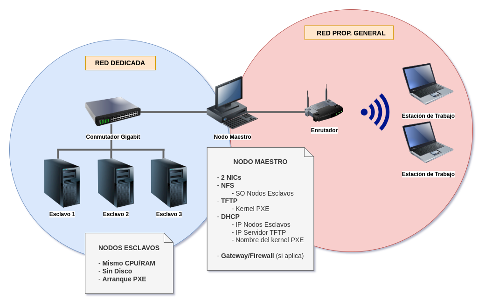

# Manual de Configuración

## 1. Introducción

Consideramos la siguiente arquitectura:



El clúster se encuentra conformado por los siguientes elementos críticos:

- **3 nodos esclavos**: realizan las operaciones de cómputo del clúster.
- **1 nodo maestro**: controla operaciones y provee servicios tanto al clúster como a la red general.
- **1 conmutador**: da soporte para la red interna del clúster.

En la Figura 1, el "enrutador" y los equipos "estación de trabajo" no forman parte de la arquitectura crítica del clúster; simplemente representan la forma en la que los equipos finales consumen los servicios de cómputo proporcionados por el clúster. En resumen, el usuario puede iniciar sesión con sus credenciales en el nodo maestro; y desde ahí, asignar tareas y trabajos al cluster mediante una interfaz de comandos. Por esta razón, es que necesitamos 2 interfaces de red en el nodo maestro: una para la comunicación *inter-cluster* (red dedicada), y la otra para conectar el clúster mismo a la red del cliente (red general).

Respecto a los nodos esclavo, es importante mencionar que no cuentan con unidades de disco duro, ya que el arranque de sus sistemas operativo, y los sistemas de archivos, son servidos por el nodo maestro mediante red.

### 1.1 Servicios de la red general

Esta sección se refire a los servicios proporcionados por el nodo maestro (y por extensión, el clúster) en la red del cliente, los cuales se especifican en las siguientes subsecciones.

#### 1.1.1 Servidor SSH

El servidor SSH proporciona un canal de comunicación seguro para los usuarios, los cuales pueden autenticarse mediante contraseña o mediante un par de claves RSA. De esta forma, la configuración de acceso al cluster se reduce a la configuración de los usuarios del nodo maestro.

### 1.2 Servicios de la red dedicada

En esta sección, definimos los servicios proporcionados por el nodo maestro a los nodos esclavos en la red dedicada. Estos servicios sirven simplemente para hacer funcionar a los nodos como una entidad integrada, y no tienen razón ni propósito fuera de la red dedicada.

#### 1.2.1 Servidor DHCP

El servidor DHCP le permite al nodo maestro definir y asignar direcciones IP a los nodos esclavos que se conecten al conmutador. Además, también les indica a los nodos esclavos la dirección del servidor TFTP.

#### 1.2.2 Servidor TFTP

El servidor TFTP proporciona un servicio de transferencia de archivos sin autenticación, de forma que los clientes pueden simplemente conectarse y solicitar ciertos archivos. En particular, nosotros usamos este servicio para proporcionar el cargador de arranque y su configuración, siendo esta última dependiente del nodo que la esté solicitando. Esto es importante, ya que cada nodo esclavo tiene acceso a un sistema de archivos específico, y la manera de filtrar este parámetro es mediante la dirección IP (ó MAC, en su defecto) que tenga el nodo.

#### 1.2.3 Servidor NFS

El servidor NFS nos permite compartir los sistemas de archivos de los nodos esclavos por la red, de forma que los nodos esclavos pueden montarlos como si de un disco duro se tratase. Como ya mencionamos en la sección anterior, la configuración de arranque le asigna a cada nodo un sistema de archivos dependiendo de su dirección IP.

#### 1.2.4 Servidor SSH (nodos esclavo)

Cabe mencionar que los nodos esclavo tienen configurado un servidor SSH exclusivamente para ser accedido por el nodo maestro. Esto con el único propósito de pasarle instrucciones de cómputo paralelo a los nodos esclavo.

### 1.3 Direccionamiento IP

En esta sección, definimos la configuración de red utilizada.

#### 1.3.1 Red general

El direccionamiento de esta red depende de la configuración del cliente, y no está a nuestro alcance, por lo que para este "lado" del clúster, simplemente configuramos el nodo maestro para que tome la dirección IP automáticamente.

#### 1.3.2 Red dedicada

Para este caso, tenemos control total sobre los parámetros de red. Dicho eso, consideramos lo siguiente:

- Usamos la red 10.0.33.0/28 (16 direcciones)
    - Nodos esclavos: 10.0.33.1-5 (5 hosts)
    - Pruebas: 10.0.33.6-10 (5 hosts)
    - Servicios: 10.0.33.11-14 (4 hosts)
    - Broadcast: 10.0.33.15

Los nodos esclavos reciben una IP estática en el rango indicado dependiendo de su dirección MAC. El segmento de pruebas está ahí únicamente para "atrapar" aquellos hosts que se conecten a la red interna pero que no tengan registro, y así facilitar su manejo mediante un firewall si es necesario. El segmento de servicios, de momento, sólo utiliza la dirección del nodo maestro, la cuál, también se asigna de forma estática mediante su MAC.

### 1.4 Sistema operativo de los nodos

El sistema operativo de los nodos consiste actualmente en una instalación base de la distribución Debian GNU\Linux en su versión estable (bullseye). Para el caso de el nodo maestro se utilizó el instalador por red (*netinstall*) obtenido desde el sitio oficial. El sistema de archivos de los nodos fué generado con *debootstrap* y configurado dentro de una jaula *chroot*.

## 2. Instalación del SO del nodo maestro

- [ ] Documentar el procedimiento de instalación (automatizado y con el instalador *netinstall*).

## 3. Configuración del nodo maestro

En esta parte, detallamos el proceso de configuración del nodo maestro, una vez que éste ya se encuentra instalado y con la configuración básica del sistema operativo.

### 3.1 Configuración de red

Configuramos ambas interfaces de red del nodo maestro en el archivo `/etc/network/interfaces`. Recordemos que una de las interfaces va conectada a la red del cliente, la cuál muy posiblemente tenga un servidor DHCP, por lo que nosotros usamos dicho servicio. La otra interfaz es la que utilizamos para la red dedicada, y a ésta le asignamos una dirección en el segmento de "Servicios" que definimos en [1.3.2 Red dedicada](#132-red-dedicada); en concreto, usamos la IP 10.0.33.14 para el nodo maestro.

```
auto [INT_1]
iface [INT_1] inet dhcp

auto [INT_2]
iface [INT_2] inet static
    address 10.0.33.14
    netmask 255.255.255.15
    network 10.0.33.0
    broadcast 10.0.33.15
```

### 3.2 Instalación y configuración del software necesario

En esta sección, definimos los componentes escenciales con los que implementaremos la comunicación y funcionamiento crítico del clúster, así como su configuración en las siguientes subsecciones.

Antes que nada, procedemos a instalar los paquetes necesarios.

```bash
apt install tftpd-hpa nfs-kernel-server isc-dhcp-server openssh-server syslinux pxelinux debootstrap
```

Los paquetes `tftpd-hpa`, `nfs-kernel-server`, `isc-dhcp-server`, y `openssh-server` corresponden a los servicios TFTP, NFS, DHCP y SSH, respectivamente. Los paquetes `syslinux` y `pxelinux` corresponden al cargador de arranque (*bootloader*) por red que usaremos; ambos paquetes nos proveen de los binarios necesarios para generar nuestras imágenes de arranque. Finalmente, el paquete `debootstrap` nos permite descargar un sistema se archivos base directamente de los repositorios de Debian.

#### 3.2.1 Configuración del servidor DHCP

La mayor parte de la configuración va en el archivo `/etc/dhcp/dhcpd.conf`. Indicamos las opciones de arranque y la configuración de la subred en donde vamos a servir el protocolo DHCP. En este caso, vamos a indicar que se sirvan automáticamente las direcciones 10.0.33.6-10 para elsegmento "Pruebas". También indicamos la puerta de enlace (el nodo maestro) y la dirección de broadcast (10.0.33.15). Cabe mencionar que a pesar de que estamos indicando la puerta de enlace, no realizamos ningún tipo de enrutamiento entre la red dedicada y la red general.

```
allow booting;
allow bootp;
subnet 10.0.33.0 netmask 255.255.255.15 {
    range 10.0.33.6 10.0.33.10;
    option routers 10.0.33.1;
    option broadcast-address 10.0.33.15;
}
```

La siguiente parte de la configuración va en el archivo `/etc/default/isc-dhcp-server`. Aquí simplemente indicamos el archivo de configuración que acabamos de editar, el archivo para el *process id* y la interfaz en donde vamos a proporcionar el servicio. Recordemos que esta interfaz debe ser la que usaremos para la red dedicada (la que va conectada al conmutador).

```
DHCPDv4_CONF=/etc/dhcp/dhcpd.conf
DHCPDv4_PID=/var/run/dhcpd.pid
INTERFACESv4="[IFACE]"
```

Luego de cualquier cambio en la configuración, es necesario reiniciar el servicio:

```bash
systemctl restart isc-dhcp-server
```

Ahora ya podemos conectar un dispositivo al conmutador y nos debería asignar una dirección en el segmento "Pruebas", ya que no tenemos dispositivos estáticos configurados. Los nodos esclavos los configuraremos en la siguiente parte.

#### 3.2.2 Configuración del servidor TFTP

Este servicio necesita que le proporcionemos un directorio especial que contiene los archivos que vamos a servir.

```bash
mkdir /srv/tftp
```

Ahora configuramos el servicio en el archivo `/etc/default/tftpd-hpa`. Indicamos el directorio que acabamos de crear, el par IP-puerto donde queremos el servicio (que en este caso, es el la del nodo maestro), y las opciones de configuración.

```
TFTP_USERNAME="tftp"
TFTP_DIRECTORY="/srv/tftp"
TFTP_ADDRESS="10.0.33.1:69"
TFTP_OPTIONS="--secure --create"
```

Luego de cualquier cambio en la configuración TFTP, debemos reiniciar el servicio.

```bash
systemctl restart tftpd-hpa
```

En este punto, ya podemos colocar cuaquier archivo que queramos servir en el directorio `/srv/tftp`.

#### 3.2.3 Configuración del servidor NFS

Usaremos este servicio para servir los sistemas de archivos de cada nodo, por lo que creamos un directorio para esos sistemas de archivos.

```bash
mkdir /srv/nfs
```

Luego de eso es necesario que editemos el archivo de configuración `/etc/exports` y, por cada nodo que agregemos, necesitaremos una línea como la siguiente:

```
[DIR] [IP_NODE](rw,async,no_root_squashm,no_subtree_check)
```

En la línea anterior, `[DIR]` corresponde al sistema de archivos de ese nodo en particular. Dicho sistema de archvios debe estar dentro del directorio que creamos `/srv/nfs`. Sin embargo, eso lo haremos en secciones posteriores.

#### 3.2.4 Configuración del servidor SSH

- [ ] Pendiente la config. de `openssh-server`.

### 3.3 Generación del nodo esclavo genérico

En esta sección, crearemos un archivo conmprimido que contendrá el sistema de archivos genérico de un nodo esclavo. Y decimos genérico porque una vez establecido el sistema de archivos es neceario configurar unos parámetros específicos para cada nodo (por ejemplo, el *hostname*); pero eso lo haremos cuando llegue el momento de crear cada nodo.

#### 3.3.1 Descarga del sistema base

Primero necesitamos crear un directorio para nuestro sistema de archivos genérico y luego descargamos el sistema base. Este paso puede tomar varios minutos dependiendo de la velocidad de descarga.

```bash
mkdir /srv/nfs/nodeX
debootstrap --arch amd64 bullseye /srv/nfs/nodeX https://deb.debian.org/debian
```

**Sobre CHROOT**

Para "acceder" al sistema de archivos del nodo genérico (y de cualquier nodo), usamos una jaula *chroot* de la siguiente forma.

```bash
# ANTES de chroot
mount -o bind /dev /srv/nfs/nodeX/dev
mount -o bind /run /srv/nfs/nodeX/run
mount -o bind /sys /srv/nfs/nodeX/sys

chroot /srv/nfs/nodeX/

# DENTRO de chroot
mount -t proc proc proc
```

#### 3.3.2 Configuración de puntos de montaje

Los puntos de montaje no varían respecto a los nodos por lo que los podemos configurar en este momento en el archivo `/srv/nfs/nodeX/etc/fstab`.

```
/dev/nfs / nfs tcp,nolock 0 0
proc /proc proc defaults 0 0
none /tmp tmpfs defaults 0 0
none /var/tmp tmpfs defaults 0 0
none /media tmpfs defaults 0 0
none /var/log tmpfs defaults 0 0
```

#### 3.3.3 Instalación de software

**NOTA**: usar la jaula.

En esta sección instalamos el software crítico de cada nodo esclavo

**PENDIENTE**

- [ ] Servidor SSH, RSA
- [ ] MPI

#### 3.3.4 Generación de sistema de archivos RAM inicial para PXE

**NOTA**: usar la jaula.

Instalamos los paquetes necesarios (el kernel y las herramientas initramfs).

```bash
apt install initramfs-tools linux-image-amd64
```

Indicamos a la configuración que necesitamos los controladores NFS durante el arranque.

```bash
echo BOOT=nfs >> /etc/initramfs-tools/initramfs.conf
```

Generamos el sistema de archivos RAM inicial y el kernel, ambos para el arranque PXE.
```bash
mkinitramfs -o /boot/initrd.pxe
update-initramfs -u
cp -vax /boot/initrd.img-[CURRENT_KERNEL] /boot/initrd.pxe
cp -vax /boot/vmlinuz-[CURRENT_KERNEL] /boot/vmlinuz.pxe
```

Ahora **salimos de la jaula** y recuperamos los archivos PXE que acabamos de crear, y los ponemos en el directorio de servicio del servidor TFTP, ya que son los que usarán los nodos esclavos para arrancar.

```bash
cp -vax /srv/nfs/boot/*.pxe /srv/tftp
```

#### 3.3.6 Generación del comprimido del sistema base

Una vez que recuperamos los archivos PXE del sistema de archivos genérico, estamos listos para comprimir dicho directorio, ya que es el que usaremos para crear el sistema de archivos de cada nodo esclavo nuevo que creemos en el futuro. Dicho esto, procedemos a comprimir el directorio y eliminamos el directorio del nodo genérico.

**NOTA**: es necesario moverse al directorio padre de `nodeX` para evitar que el comprimido contenga la ruta completa, eso lo hacemos con la opción `-C` del comando `tar`.

```bash
tar czvf /srv/nfs/nodeX.tgz -C /srv/nfs/ nodeX --remove-files
```

Esto nos generará el archivo `/srv/nfs/nodeX.tgz`; el cuál, podremos descomprimir cada que necesitemos un nuevo sistema de archivos para un nuevo nodo esclavo.

## 4. Creación de los nodos esclavos

En esta sección detallamos el procedimiento a seguir para configurar un nuevo nodo esclavo. Primero que nada, es necesario tomar nota de la **dirección MAC** del nuevo nodo y considerar los nodos esclavo ya existentes. Asumiremos como ejemplo la creación del **primer nodo esclavo**.

### 4.1 Configuración DHCP

Procedemos a añadir la configuración DHCP del nodo esclavo número 1. Recordemos que las direcciones IP de estos nodos serán estáticas y en el segmento "Nodos esclavo". El número de la IP define el número del nodo. En este caso, tendríamos la dirección 10.0.33.1; para el segundo nodo, tendríamos 10.0.33.2 y así sucesivamente. También es necesario especificarle a cada nodo el archivo `pxelinux.0` y la dirección del servidor TFTP; por lo que crearemos un **grupo** para configurar estos parámetros, y no tener que repetirlos en el bloque de cada nodo.

Con éste primer nodo esclavo agregado, la configuración en `/etc/dhcp/dhcpd.conf` quedaría de la siguiente forma. **NOTA**: reemplazar `[MAC]` por la dirección MAC del nodo en cuestión.

```
allow booting;
allow bootp;
subnet 10.0.33.0 netmask 255.255.255.15 {
    range 10.0.33.6 10.0.33.10;
    option routers 10.0.33.14;
    option broadcast-address 10.0.33.15;
    group {                                     # grupo para nodos esclavo
        filename "pxelinux.0";                  # imagen de arranque PXE
        next-server 10.0.33.14;                  # IP del servidor TFTP (de donde descarga la imagen de arranque)
        host node1 {                            # bloque del nodo esclavo 1 (repetir para cada nodo)
            hardware ethernet "[MAC]";
            fixed-address 10.0.33.1;
        }

    }
}
```

Luego de este cambio, reiniciamos el servidor DHCP.

```bash
systemctl restart isc-dhcp-server
```

### 4.2 Sistema de archivos

Procedemos a generar el sistema de archivos del primer nodo. Recordemos que, en secciones anteriores, creamos un archivo comprimido con una versión genérica de dicho sistema de archivos. Lo único que necesitamos hacer es descomprimir una copia, renombrarla con el nombre del nodo y realizar las configuraciones pertinentes en dicho sistema de archivos.

```bash
cd /srv/nfs
tar xzvf nodeX.tgz
mv nodeX node1
```

Ahora ya podemos configurar el sistema de archivos, ya sea directamente o usando una jaula *chroot*, dependiendo del caso.

#### 4.2.1 Nombre del host

Configuramos el nombre del host del nodo 1

```bash
echo nodo1 > /srv/nfs/node1/etc/hostname
```

- [ ] Verificar si hay configuración necesaria que deba añadirse en esta parte.

### 4.3 Configuración NFS

Cuando ya tenemos el sistema de archivos con su configuración correspondiente, le indicamos al servidor NFS la dirección IP del host que tendrá permiso para acceder al mismo. Para ello modificamos el archivo `/etc/exports`. **NOTA**: para los siguientes nodos, es necesario replicar esta línea y cambiar la dirección IP.

```
/srv/nfs 10.0.33.1(rw,async,no_root_squashm,no_subtree_check)
```

Reiniciamos el servidor NFS.

```bash
systemctl restart nfs-server
```

### 4.5 Configuración TFTP/PXE

Ahora necesitamos indicar el archivo de configuración de arranque PXE. Al momento de iniciar el nodo esclavo obtendrá la imagen del cargador de arranque, y posteriormente descargará su configuración. Cada nodo tendrá una configuración de arranque distinta, puesto que cada nodo carga un sistema de archivos diferente. Esto significa que tendremos varios archivos de configuración de arranque; estos archivos de configuración estarán en el directorio `/srv/tftp/pxelinux.cfg`, por lo que procedemos a crearlo.

```bash
mkdir /srv/tftp/pxelinux.cfg
```

La forma en la que el cargador de arranque sabrá qué archivo de configuración descargar, es mediante su dirección IP; es decir, el archivo de configuración tendrá como nombre la **dirección IP del nodo esclavo en hexadecimal**. Como el nodo 1 tiene la dirección en 10.0.33.1, entonces su archivo de configuración será `/srv/tftp/pxelinux.cfg/0A002101`, y contiene la siguiente estructura.

```
default node1
prompt 1
timeout 3
    label node1
    kernel vmlinuz.pxe
    append rw initrd=initrd.pxe root=/dev/nfs ip=dhcp nfsroot=10.0.33.14:/srv/nfs/node1
```
